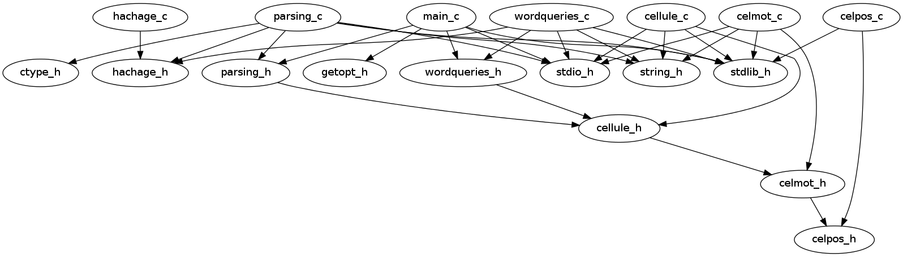

# Compte-rendu du projet d'algorithmie

> Auteurs: [Paul Ollivier]( <contact@paulollivier.fr> ), [Hosni Dahmani]( <hosni.dahmani@gmail.com> )

> Date: 02/06/2013

## Introduction

Le sujet de ce projet était d’écrire un programme permettant d’effectuer des recherches dans un texte, et d’obtenir statistiques et positions de mots pour analyse future.

## Mode d'emploi

### Récupération des sources

Afin de pouvoir utiliser le programme écrit dans le cadre de ce projet, le plus simple est d'obtenir les sources via git, si vous ne les possédez pas déjà:

    $ git clone https://github.com/paulollivier/algo-project ProjetAlgo

ou alors en téléchargeant une archive à l’url [https://github.com/paulollivier/algo-project/archive/master.zip](https://github.com/paulollivier/algo-project/archive/master.zip) .

### Compilation

La compilation se fait dans le répertoire racine du projet grâce à la commande make, un binaire nommé Index sera généré.

Ce binaire nous permettra d’exécuter le programme.

### Exécution

L’exécution du programme en mode non-interactif requiert obligatoirement des options, Pour prendre connaissance des options requises:

    ./Index -h

L’exécution du programme sans aucune option lancera le mode interactif, ou un menu apparaîtra et permettra le questionnement multiple. Ce comportement peut être pratique sur les très larges fichiers.

Pour exécuter le programme en mode non-interactif ( avec les options ), la commande doit respecter la forme suivante:

    ./Index -option [argument] Fichier

*option* étant l’interrogation de l’utilisateur.

*[argument]* étant un complément de l’interrogation, qui dépends de celle-ci.

*Fichier* étant le chemin du texte traité.

Voici la liste des options :

* -a ou --appartient
Indique si un mot appartient au texte ou non.

```

./Index [-a][--appartient] mot Fichier
```

* -p ou --positions
Affiche la suite des positions de mot dans le texte.

```

./Index [-p] [--positions] mot Fichier
```

* -P ou --phrases
Affiche les phrases du texte contenant mot.

```

./Index [-P] [--phrases] mot Fichier
```

* -l ou  --liste
Affiche la liste triée des mots du texte.

```

./Index [-l] [--liste] Fichier
```

* -d ou --prefixe
Affiche l’ensemble des mots du texte ayant mot pour préfixe.

```

./Index [-d] [--prefixe] mot Fichier
```

* -D ou --tofile
Sauve dans un fichier la liste triée des mots du texte et leur position dans un fichier.
Le fichier aura pour nom le nom du fichier entré suivi du suffixe “.DICO”. Chaque ligne de ce fichier sera constituée d’un mot suivi de la liste de ses positions.

```

./Index [-D] [--tofile] Fichier
```

Le programme peut être exécuté à partir de n’importe quel repertoire, il faut par ailleurs bien préciser son emplacement :

Si le répertoire courant correspond à l’emplacement ou se trouve Index :

    ./Index -option [mot] Fichier

Si Index se trouve dans un autre emplacement quelconque, ne se trouvant pas dans votre $PATH:

    /chemin/vers/Index -option [mot] Fichier

## Architecture

Le but de ce projet est de générer une table de hash des mots contenus dans un fichier donné, et ce afin de pouvoir effectuer des opérations de recherche sur ce texte, si possible avec une complexité maximum de l'ordre *O(n)*.

### Organisation du code et conventions adoptées



l'intégralité du code utile est dans le répertoire `src`. Dans ce répertoire se trouve un autre dossier, `structs`, qui contient toutes les structures et fonctions agissant sur celles-ci. à la racine du répertoire `src` se trouvent les fonctions permettant la manipulation des données du programme, ainsi que leur logique.

La plupart des fichiers respectent les conventions les plus classiques du C, à savoir:

* un fichier .h et .c pour chaque ensemble logique de fonctions, le .h servant au partage des définitions et le .c contenant le code effectif
* le nom des fonctions est intégralement en minuscule, avec des sous groupes éventuels, séparés par un `_` (*underscore*). Exemple: `print_sentences_containing_word`

### Détail des fichiers et fonctions

Nous allons détailler dans cette section l'utilisation des fonctions créées. Afin d'obtenir plus de détail concernant leur implémentation, nous vous proposons de consulter les fichiers sources, dont vous devriez avoir reçu une copie avec ce fichier, ou sur [GitHub](https://github.com/paulollivier/algo-project).

#### Structures de données

Chaque mot est stocké dans un `Celmot` (voir `structs/celmot.h`), auquel est associé une liste chaînée de positions ( voir `structs/celpos.h`). Chaque `Celmot` est contenue dans une liste (voir `structs/cellule.h`), afin de faciliter leur usage dans le cadre du tri par ordre alphabétique, et gérer les collisions dans les hash.

#### main

Le main.c contient le point d'entré du programme, la fonction main. Ce fichier gère les arguments, le menu interactif, se charge d'orchestrer le tout.

#### wordqueries

`wordqueries` définit les différentes fonctions de recherche en fonction de la question posée.

* `belongs` vérifie la présence d'un mot dans la table de hachage. renvoie *1* si présent, *0* sinon. Appellé par l'option -a *MOT*.
* `print_positions` affiche les positions pour le mot passé en paramètre. Appellé par l'option -p *MOT*.
* `print_sentences_containing_word` Affiche les phrases contenant le mot passé en paramètre. Il est bon de noter qu'afin que les phrases puissent être récupérées, le nom du fichier doit être passé en paramètre pour lire lesdites phrases.
* `print_alphabetical` affiche le contenu de la liste passée en paramètre. Cette liste doit être triée au préalable. Cette fonction est distinguée de `liste_print` car elle afiche les informations d'une manière plus "brute".
* `print_all_from_prefix` affiche tous les mots commençant par _prefix_.
* `save_positions_to_file` sauvegarde la sortie de `print_alphabetical` vers le fichier _filename_ donné. Si ce dernier n'a pas l'extension *.DICO*, *.DICO* est ajouté.

#### hachage

`hachage` définit une fonction de hachage générant un entier à partir d'une chaîne, `hache(char* mot)`.

#### parsing

`parsing` contient toutes les définitions de fonction liées au parsing initial du fichier à analyser. Trois fonctions principales sont disponibles:

```c

int parse_file(
    Cellule* tab,
    long size_of_tab,
    char* fname,
    Liste* alphabetical_word_list);
```

`parse_file` se charge de tout le parsing du fichier. Elle se charge de délimiter les phrases, puis de passer ces phrases à `parse_sentence`.

```c

int parse_sentence(
    Cellule* tab,
    long size_of_tab,
    unsigned char* sentence,
    unsigned short sentence_len,
    unsigned long sentence_pos,
    Liste* alphabetical_word_list);
```

`parse_sentence` se charge du parsing des phrases. Elle sépare les mots tels que définit comme une chaîne ne comportant aucun espace, ou newline. Elle passe ensuite ces mots à `add_word`.

```c

int add_word(
    Cellule* tab,
    long size_of_tab,
    unsigned char* word,
    unsigned short word_len,
    unsigned long sentence_pos,
    Liste* alphabetical_word_list);
```

`add_word` est responsable du placement du mot au bon endroit dans le tableau de hash, ainsi que dans la liste, par ordre alphabétique.

